# Alexander D. Lebedev

**ML Specialist / Developer · Artificial Intelligence Laboratory · Dubna State University**  
**Computer Science & Engineering · ACM Certified Reviewer**

 

  

<code>research question → architecture → agents → experiments → evidence → publication</code>

365 days of building, experimenting and shipping.

---

# `01 // RESEARCH`

I build **interpretable and trustworthy AI systems**, combining model development, experimental validation and research software engineering.

My main interests are **Explainable AI, neuro-fuzzy systems, structural interpretability, robustness, reproducibility and AI evaluation**.

```mermaid
flowchart LR

    R["AI Research"]

    X["Explainable &<br/>Trustworthy AI"]
    N["Neuro-Fuzzy &<br/>Interpretable Models"]
    V["Evaluation &<br/>Robustness"]
    E["Research<br/>Engineering"]

    R --> X
    R --> N
    R --> V
    R --> E

    style R fill:#111827,stroke:#00F5FF,stroke-width:2px
    style X fill:#111827,stroke:#FF2BD6
    style N fill:#111827,stroke:#7B2CFF
    style V fill:#111827,stroke:#00F5FF
    style E fill:#111827,stroke:#FF2BD6
```

# `02 // RESEARCH SYSTEMS`

<table>
<tr>

<td width="50%" valign="top">

### Trust-ADE

**Trust Assessment through Dynamic Explainability**

Quantitative assessment of AI systems through explanation quality, robustness, concept drift and bias shift.

`Trustworthy AI` `XAI` `Evaluation`

<a href="https://github.com/fims9000/Trust-ADE"><b>CODE ↗</b></a>

</td>

<td width="50%" valign="top">

### Verified Explainability Core

Hybrid **GD-ANFIS / SHAP** architecture integrating explainability with model training and validation.

`ANFIS` `SHAP` `XAI 2.0`

<a href="https://github.com/fims9000/XAI-2.0-SHAP-regularized-ANFIS"><b>CODE ↗</b></a>

</td>

</tr>

<tr>

<td width="50%" valign="top">

### Fuzzy Attention Networks

Differentiable fuzzy attention for multimodal learning with interpretable reasoning mechanisms.

`Fuzzy Attention` `Multimodal AI` `PyTorch`

<a href="https://github.com/fims9000/FuzzyAttentionNetworks"><b>CODE ↗</b></a>
&nbsp;·&nbsp;
<a href="https://doi.org/10.36871/2618-9976.2025.11.003"><b>PAPER ↗</b></a>

</td>

<td width="50%" valign="top">

### Deep Neuro-Fuzzy / Routed KAFN

Deep neuro-fuzzy models and Routed Kolmogorov-Arnold Fuzzy Networks with structural interpretability and stability analysis.

`KAFN` `Neuro-Fuzzy` `Interpretability`

<a href="https://github.com/fims9000/deep-neuro-fuzzy"><b>CODE ↗</b></a>

</td>

</tr>

<tr>

<td width="50%" valign="top">

### KAN-XAI 2.0

Hybrid explainable architectures combining Kolmogorov-Arnold Networks, fuzzy systems and interpretable decision mechanisms.

`KAN` `Hybrid AI` `XAI`

<a href="https://github.com/fims9000/KAN-XAI-2.0-System"><b>CODE ↗</b></a>
&nbsp;·&nbsp;
<a href="https://doi.org/10.1007/978-3-032-13612-1_4"><b>PAPER ↗</b></a>

</td>

<td width="50%" valign="top">

### ANZA-LIRA

Scientific vision pipeline for seismic fault segmentation using anisotropic geometry, topology and graph reasoning.

`Computer Vision` `Topology` `Scientific ML`

<a href="https://github.com/fims9000/anza_lira"><b>CODE ↗</b></a>

</td>

</tr>
</table>

<b>More research systems</b>

 

### BeaconXAI

Budgeted counter-evidence auditing for black-box time-series models with adaptive evaluation budgets.

<a href="https://github.com/fims9000/BeaconXAI"><b>CODE ↗</b></a>

### SynergiXAI

Reproducible lifecycle management and evaluation of explainable AI models.

`AutoXAI` `Reproducibility` `Model lifecycle`

### NeuroFuzzy Master

Desktop research environment for ANFIS analysis, training and visualization.

`ANFIS` `Desktop ML` `Research tooling`

# `03 // SELECTED PUBLICATIONS`

### 2026

**Verified Explainability Core: A GD–ANFIS/SHAP Hybrid Architecture for XAI 2.0**  
*Automatic Documentation and Mathematical Linguistics*, **59(S5)**, S469–S478.

 

**Hybrid and Hierarchical Explainable AI Based on Kolmogorov–Arnold Networks**  
*Lecture Notes in Networks and Systems*, **Vol. 1763**, Springer, 36–43.  
<a href="https://doi.org/10.1007/978-3-032-13612-1_4">DOI ↗</a>

 

**SynergiXAI Platform Architectural Model for Reproducible Lifecycle Management of Artificial Intelligence Models**  
*Soft Measurements and Computing*, No. 3-2, 101–119.

### 2025

**A Fuzzy Transformer for Multimodal AI: Differentiable Fuzzy Attention and Adaptive Explanations**  
*Soft Measurements and Computing*, No. 11, 34–55.  
<a href="https://doi.org/10.36871/2618-9976.2025.11.003">DOI ↗</a>

 

**HYBRID-XIRIS: Neuro-Fuzzy Architecture for Explainable Biometric Identification by Iris**  
*Soft Measurements and Computing*, No. 12-2, 119–132.

### Accepted / Forthcoming

**Routed Kolmogorov-Arnold Fuzzy Networks for Stable Interpretable Prediction**  
IITI'26 · Springer Proceedings

**Concept-Latent Space Alignment in Fuzzy Attention Networks for Safety-Critical Intelligent Decision Support**  
IITI'26 · Springer Proceedings

# `04 // AGENTIC RESEARCH ENGINEERING`

AI coding agents are a **primary implementation interface** in my workflow.

I define the problem, system architecture, constraints and evaluation protocol. Agents accelerate implementation and experimentation; results are accepted only after testing and evidence-based validation.

```mermaid
flowchart LR

    Q["Research<br/>Question"]
    S["Architecture &<br/>Specification"]
    A["Agent<br/>Orchestration"]

    C["Implementation"]
    E["Experiments"]

    T["Tests"]
    M["Metrics &<br/>Evidence"]

    H["Human<br/>Validation"]

    R["Research<br/>Artifact"]

    Q --> S
    S --> A

    A --> C
    A --> E

    C --> T
    E --> M

    T --> H
    M --> H

    H -->|"refine"| S
    H -->|"accept"| R

    style A fill:#111827,stroke:#FF2BD6,stroke-width:2px
    style H fill:#111827,stroke:#00F5FF,stroke-width:2px
    style Q fill:#111827,stroke:#7B2CFF
    style R fill:#111827,stroke:#00F5FF
```

> **Agents accelerate implementation. Evidence decides what survives.**

# `05 // ENGINEERING STACK`

 

<table>

<tr>

<td width="33%" valign="top">

### AI / ML

`PyTorch`  
`TensorFlow`  
`scikit-learn`  
`XGBoost`  
`LightGBM`  
`CatBoost`  
`NumPy`  
`Pandas`

</td>

<td width="33%" valign="top">

### XAI / Neuro-Fuzzy

`SHAP`  
`LIME`  
`Captum`  
`ANFIS`  
`xanfis`  
`scikit-fuzzy`  
`KAN / KAFN`  
`Fuzzy Attention`

</td>

<td width="33%" valign="top">

### Systems / Infra

`FastAPI / REST`  
`PostgreSQL`  
`Docker / Podman`  
`Linux`  
`Git / GitHub`  
`Bash`  
`Ollama / Local LLMs`  
`Agent workflows`

</td>

</tr>

</table>

---

# `06 // GITHUB TELEMETRY`

 

 

 

<picture>

  <source
    media="(prefers-color-scheme: dark)"
    srcset="https://github-readme-activity-graph.vercel.app/graph?username=lebedeffson&bg_color=0d1117&color=c9d1d9&title_color=00f5ff&line=00f5ff&point=ff2bd6&area_color=7b2cff&area=true&hide_border=true&radius=8">

  

</picture>

### `BUILD // TEST // EXPLAIN // VERIFY`

**AI systems should not only produce answers — they should survive inspection.**

