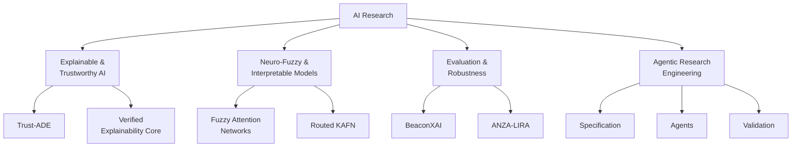
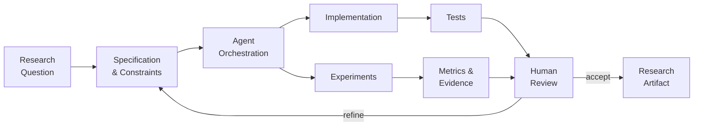

<div align="center">

# Alexander D. Lebedev
[](https://git.io/typing-svg)

<a href="https://orcid.org/0009-0001-1046-5982">
  
</a>
<a href="https://scholar.google.com/citations?user=jkRWQbgAAAAJ">
  
</a>
<a href="https://www.researchgate.net/profile/Alexander-Lebedev-20">
  
</a>
<a href="mailto:lebedev0lexander@gmail.com">
  
</a>

<br><br>


</div>

---

## Research

I work on **interpretable and trustworthy artificial intelligence**, with a particular focus on neuro-fuzzy models, explanation quality, robustness, reproducibility and scientific evaluation.

My research combines **model development**, **experimental validation** and **research software engineering**.



---

# Research Systems

<table>
<tr>

<td width="50%" valign="top">

### Trust-ADE

**Trust Assessment through Dynamic Explainability**

Protocol-oriented assessment of AI systems through explanation quality, robustness, concept drift and bias shift.

`Trustworthy AI` `XAI` `Evaluation`

<a href="https://github.com/fims9000/Trust-ADE"><b>Code ↗</b></a>

</td>

<td width="50%" valign="top">

### Verified Explainability Core

Hybrid **GD-ANFIS / SHAP** architecture exploring explainability as part of the learning and validation process.

`ANFIS` `SHAP` `XAI 2.0`

<a href="https://github.com/fims9000/XAI-2.0-SHAP-regularized-ANFIS"><b>Code ↗</b></a>

</td>

</tr>

<tr>

<td width="50%" valign="top">

### Fuzzy Attention Networks

Differentiable fuzzy attention for multimodal learning with intrinsic mechanisms for interpretable reasoning.

`Fuzzy Attention` `Multimodal AI` `PyTorch`

<a href="https://github.com/fims9000/FuzzyAttentionNetworks"><b>Code ↗</b></a>
&nbsp;·&nbsp;
<a href="https://doi.org/10.36871/2618-9976.2025.11.003"><b>Paper ↗</b></a>

</td>

<td width="50%" valign="top">

### Deep Neuro-Fuzzy / Routed KAFN

Research framework for deep neuro-fuzzy models and Routed Kolmogorov-Arnold Fuzzy Networks with structural interpretability and stability analysis.

`KAFN` `Neuro-Fuzzy` `Interpretability`

<a href="https://github.com/fims9000/deep-neuro-fuzzy"><b>Code ↗</b></a>

</td>

</tr>

<tr>

<td width="50%" valign="top">

### KAN-XAI 2.0

Hybrid and hierarchical explainable architectures based on Kolmogorov-Arnold Networks, fuzzy components and interpretable decision mechanisms.

`KAN` `Hybrid AI` `XAI`

<a href="https://github.com/fims9000/KAN-XAI-2.0-System"><b>Code ↗</b></a>
&nbsp;·&nbsp;
<a href="https://doi.org/10.1007/978-3-032-13612-1_4"><b>Paper ↗</b></a>

</td>

<td width="50%" valign="top">

### ANZA-LIRA

Scientific vision pipeline for segmentation and structural continuation of thin seismic faults using anisotropic geometry, topology and graph reasoning.

`Computer Vision` `Topology` `Scientific ML`

<a href="https://github.com/fims9000/anza_lira"><b>Code ↗</b></a>

</td>

</tr>
</table>

<details>

<summary><b>More research systems</b></summary>

<br>

### BeaconXAI

Budgeted counter-evidence auditing for black-box time-series models with adaptive evaluation budgets and edge-oriented analysis.

<a href="https://github.com/fims9000/BeaconXAI">Code ↗</a>

<br>

### SynergiXAI

Architecture for reproducible lifecycle management and evaluation of explainable AI models.

`Reproducibility · AutoXAI · Model lifecycle`

<br>

### NeuroFuzzy Master

Desktop research environment for ANFIS data analysis, model training and visualization.

`ANFIS · Desktop ML · Research tooling`

</details>

---

# Selected Publications

<!-- PUBLICATIONS:START -->

### 2026

**Verified Explainability Core: A GD–ANFIS/SHAP Hybrid Architecture for XAI 2.0**  
*Automatic Documentation and Mathematical Linguistics*, **59(S5)**, S469–S478.

<br>

**Hybrid and Hierarchical Explainable AI Based on Kolmogorov–Arnold Networks**  
*Lecture Notes in Networks and Systems*, **Vol. 1763**, Springer, 36–43.  
<a href="https://doi.org/10.1007/978-3-032-13612-1_4">DOI ↗</a>

<br>

**SynergiXAI Platform Architectural Model for Reproducible Lifecycle Management of Artificial Intelligence Models**  
*Soft Measurements and Computing*, No. 3-2, 101–119.

<br>

**Algebraic Operations on Multilevel Explanations and Quantification of Their Uncertainty**  
*Soft Measurements and Computing*, No. 2-2, 64–99.

---

### 2025

**A Fuzzy Transformer for Multimodal AI: Differentiable Fuzzy Attention and Adaptive Explanations**  
*Soft Measurements and Computing*, No. 11, 34–55.  
<a href="https://doi.org/10.36871/2618-9976.2025.11.003">DOI ↗</a>

<br>

**HYBRID-XIRIS: Neuro-Fuzzy Architecture for Explainable Biometric Identification by Iris**  
*Soft Measurements and Computing*, No. 12-2, 119–132.

---

### Accepted / Forthcoming

**Routed Kolmogorov–Arnold Fuzzy Networks for Stable Interpretable Prediction**  
IITI'26 · Springer Proceedings

**Concept-Latent Space Alignment in Fuzzy Attention Networks for Safety-Critical Intelligent Decision Support**  
IITI'26 · Springer Proceedings

<!-- PUBLICATIONS:END -->

<div align="center">

### Complete research record

<a href="https://orcid.org/0009-0001-1046-5982">ORCID</a>
&nbsp;&nbsp;·&nbsp;&nbsp;
<a href="https://scholar.google.com/citations?user=jkRWQbgAAAAJ">Google Scholar</a>
&nbsp;&nbsp;·&nbsp;&nbsp;
<a href="https://www.researchgate.net/profile/Alexander-Lebedev-20">ResearchGate</a>

</div>

---

# Agentic Research Engineering

AI coding agents are a **primary implementation interface** in my development workflow.

I focus on the parts that determine whether the resulting system is actually useful scientifically: problem formulation, architecture, constraints, experimental design, evaluation and acceptance.



### The control loop

```text
define the problem
      ↓
design the system
      ↓
specify constraints
      ↓
direct coding / research agents
      ↓
run experiments
      ↓
inspect failures and evidence
      ↓
validate claims
      ↓
iterate
```

> **Agents accelerate implementation. Evidence decides whether the result survives.**

---

# Research Toolkit

<div align="center">

### Core engineering

<a href="https://skillicons.dev">

</a>

</div>

<br>

<table>
<tr>
<td width="33%" valign="top">

### ML / Scientific Computing

`PyTorch`  
`TensorFlow`  
`scikit-learn`  
`XGBoost`  
`LightGBM`  
`CatBoost`  
`NumPy`  
`Pandas`

</td>

<td width="33%" valign="top">

### Explainability

`SHAP`  
`LIME`  
`Captum`  
`DALEX`  
`Alibi`  
`InterpretML`  
`Concept-based XAI`  
`Explanation evaluation`

</td>

<td width="33%" valign="top">

### Neuro-Fuzzy

`ANFIS`  
`xanfis`  
`scikit-fuzzy`  
`Fuzzy Attention`  
`KAFN`  
`KAN`  
`Fuzzy rules`  
`Hybrid models`

</td>
</tr>
</table>

---

# Evaluation Mindset

My work is strongly oriented toward **claim–evidence alignment**.

```text
             MODEL QUALITY
                   │
        ┌──────────┼──────────┐
        │          │          │
        ▼          ▼          ▼
    Accuracy   Robustness   Explanation
                               Quality
        │          │          │
        └──────────┼──────────┘
                   ▼
              VALIDATION
                   │
     ┌─────────────┼─────────────┐
     ▼             ▼             ▼
  Baselines     Ablations    Reproducibility
     │             │             │
     └─────────────┴─────────────┘
                   │
                   ▼
                CLAIMS
```

I am particularly interested in:

`faithfulness` · `stability` · `robustness` · `uncertainty` · `calibration` · `data leakage` · `external validity` · `reproducibility`

---

# GitHub Activity

<picture>
  <source
    media="(prefers-color-scheme: dark)"
    srcset="https://github-readme-activity-graph.vercel.app/graph?username=lebedeffson&bg_color=0d1117&color=c9d1d9&line=58a6ff&point=bc8cff&area=true&hide_border=true">
  <source
    media="(prefers-color-scheme: light)"
    srcset="https://github-readme-activity-graph.vercel.app/graph?username=lebedeffson&bg_color=ffffff&color=24292f&line=0969da&point=8250df&area=true&hide_border=true">
  
</picture>

---

# Research & Academic Profile

<table>
<tr>
<td>

**ML Specialist / Developer**  
Artificial Intelligence Laboratory  
Dubna State University

</td>
<td>

**Computer Science and Engineering**  
B.Sc. · 2024–2028  
Dubna State University

</td>
<td>

**ACM Certified Reviewer**  
2026

</td>
</tr>
</table>

---

<div align="center">

### BUILD · TEST · EXPLAIN · VERIFY

**Building AI systems whose decisions can be examined, tested and challenged.**
</div>
